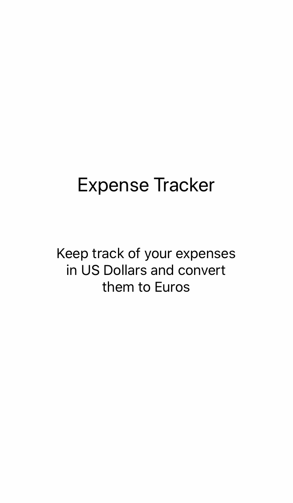
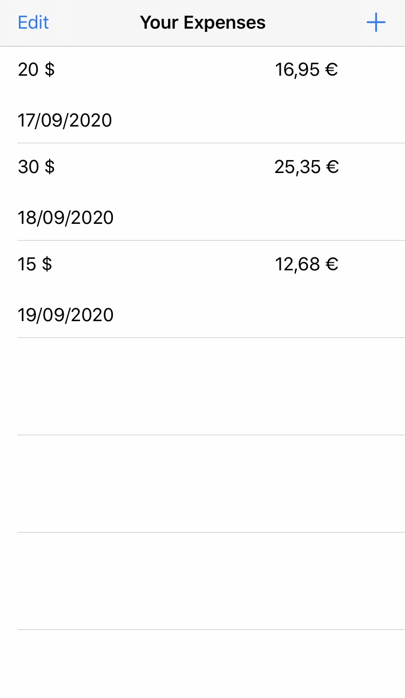
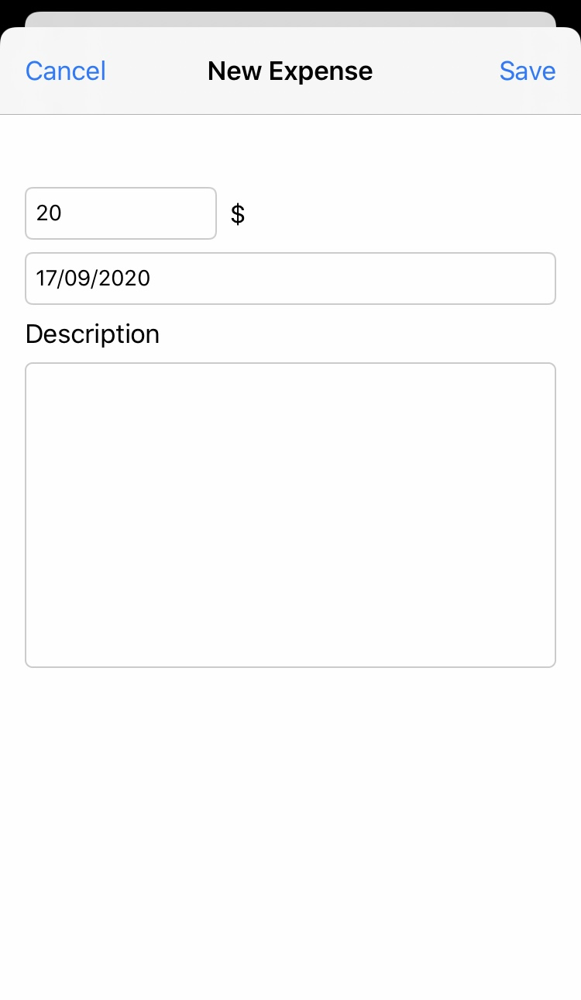
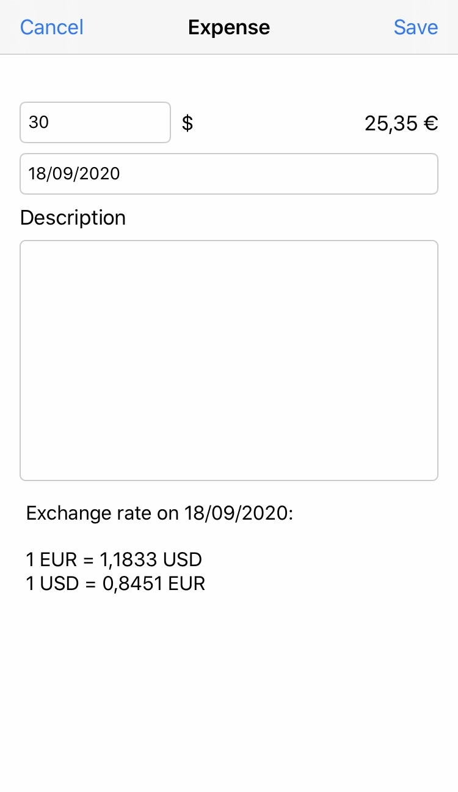

# Expense Tracker

Expense Tracker is a simple iOS app used to keep track of your expenses in US Dollars and convert them to Euros.

The app uses the reference exchange rates from the [European Central Bank](https://www.ecb.europa.eu/stats/policy_and_exchange_rates/euro_reference_exchange_rates/html/index.en.html).

Launch Screen             |  Expenses List |  New Expense | Detail Expense
:-------------------------:|:-------------------------:|:-------------------------: | :-------------------------:
  |   |  | 


## Change Currency Pair

By default, the base currency used is the euro (EUR) and the quote currency is the US dollar (USD).

### Change Quote Currency

If you want to change the quote currency to convert expenses from this new currency to euro, change the currency designator in the [expense table view controller](ExpenseTracker/ExpenseTableViewController.swift).

For example, if you want to convert from pound sterling to euro, change 
```swift
let currencyDesignator = "usd"
```

to
```swift
let currencyDesignator = "gbp"
```

### Reverse Currency Pair

If you want to reverse the currency pair (for example, convert from euros to US dollars), in the *setAmountBaseCurrency()* function in the [expense](ExpenseTracker/Expense.swift) class, change 

```swift
baseCurrencyAmount = baseCurrencyAmount / exchangeRate
```

to

```swift
baseCurrencyAmount = baseCurrencyAmount * exchangeRate
```

### Change Base Currency

The app gets exchange rates from the European Central Bank. The base currency is the euro. If you want to convert expenses between currencies other than the euro, you may want to get the exchange rates from other central banks.